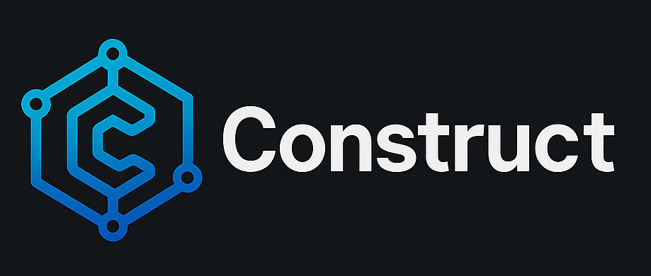

<p align="center">
  

An API-first, multi-agent coding assistant designed for superior tool calling performance.

## Overview

Construct is a next-generation coding assistant that breaks away from traditional black-box AI assistants. Built with an API-first approach, it offers unparalleled customization and extensibility while supporting multiple collaborative agents that can work together on complex tasks.

## Key Features

### API-first Architecture
Everything in Construct can be configured via API, making it highly customizable and integrable with existing workflows and tools. This is in stark contrast to traditional coding assistants that operate as black boxes with limited configuration options.

### Multi-Agentic System
Construct supports multiple agents by default that can work together on a task. The system handles agent handoffs and delegations automatically, allowing for specialized agents to tackle different aspects of a problem.

### CodeAct Tool Calling
Construct uses CodeAct tool calling with JavaScript for superior tool call performance. This approach provides more reliable and efficient tool execution compared to traditional methods.

### Additional Features

- **Multiple Model Providers**: Support for various AI models including Anthropic, OpenAI, DeepSeek, and more
- **Language SDKs**: SDKs available for multiple programming languages
- **Model Context Protocol**: Enhanced context management for improved model performance
- **Parallel Tool Use**: Execute multiple tools simultaneously for faster operations
- **Checkpoints**: Save and restore the state of your work at any point

## Architecture

Construct is built with a modular architecture that separates concerns between:

- **Backend**: Handles agent runtime, model providers, and tool execution
- **API Layer**: Provides a consistent interface for all operations
- **Frontend CLI**: Offers an intuitive terminal interface for interacting with the system

The multi-agent system allows for specialized agents to collaborate on tasks, with the runtime managing message passing and coordination between agents.

## Getting Started

### Installation

```bash
# Installation instructions will be provided here
```

### Configuration

```bash
# Basic configuration examples will be provided here
```

## Usage Examples

### Basic Usage

```bash
# Basic usage examples will be provided here
```

### Multi-Agent Collaboration

```bash
# Multi-agent collaboration examples will be provided here
```

### Custom Tool Creation

```bash
# Custom tool creation examples will be provided here
```

## Documentation

For more detailed documentation, please refer to:

- [API Reference](https://docs.construct.dev/api) (Coming soon)
- [User Guide](https://docs.construct.dev/guide) (Coming soon)
- [Tool Development](https://docs.construct.dev/tools) (Coming soon)

## Contributing

Contributions are welcome! Please feel free to submit a Pull Request.

## License

[License information will be provided here]
