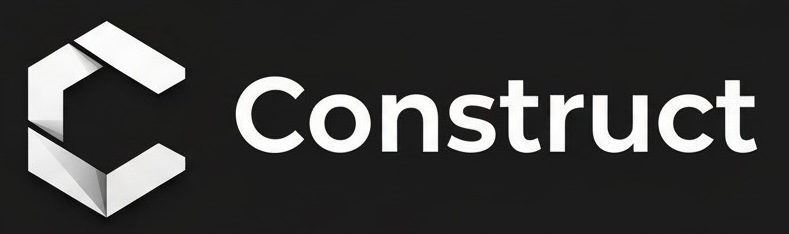
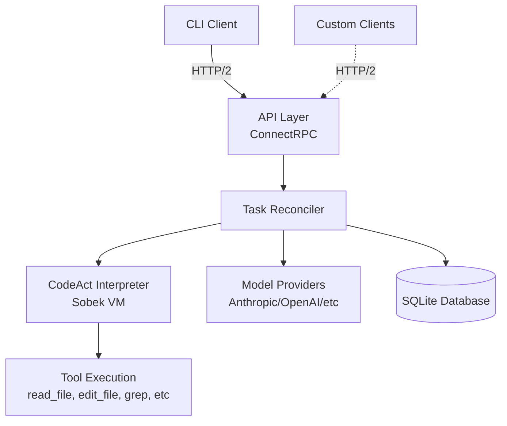

<p align="center">
  

<p align="center">
  <strong>A programmable AI coding assistant designed for automation and integration</strong>
</p>

<p align="center">
  API-first • CodeMode tool calling • Multi-agent workflows • Self-hostable
</p>

---

## Why Construct?

Most AI coding tools lock you into their interface and workflows. Construct is built for integration and automation. Construct gives you full programmatic control.

- **Programmatic control**: Script every operation, integrate with existing workflows
- **Extensibility**: Build custom agents, access everything via API
- **Vendor independence**: Self-host, switch models, no lock-in
- **Full visibility**: Export all data, track costs, inspect every operation

## Overview

Construct is an open-source AI coding assistant with an API-first architecture. Everything—agents, tasks, conversations, tool calls—is accessible programmatically. The CLI is just one client of the daemon's ConnectRPC API.

<p align="center">
  
</p>

## Key Features

### Agents Write JavaScript to Call Tools

Instead of rigid JSON schemas, agents write executable JavaScript code to call tools. This enables loops, conditionals, and complex data processing in a single execution.

**Example:** Systematically checking and fixing route files:

```javascript
// Find all route files
const routeFiles = find_file({
  pattern: "**/*route*.ts",
  path: "/project/src"
});

print(`Processing ${routeFiles.files.length} route files...`);

for (const file of routeFiles.files) {
  // Check if this file needs authentication
  const matches = grep({
    query: "router\\.(get|post).*(?!authenticateToken)",
    path: file
  });

  if (matches.total_matches > 0) {
    print(`⚠️ ${file}: Found ${matches.total_matches} unprotected endpoints`);

    // Build edits dynamically based on findings
    const edits = [];
    matches.matches.forEach(match => {
      edits.push({
        old: match.line,
        new: match.line.replace(/(\([^,]+,\s*)/, '$1authenticateToken, ')
      });
    });

    edit_file(file, edits);
    print(`✅ Protected ${edits.length} endpoints`);
  }
}
```

One execution instead of dozens of separate tool calls. Research by Wang et al. (2024) demonstrates that code-based tool calling achieves up to 20% higher success rates compared to JSON and text-based approaches across 17 different language models.

See [Tool Calling in Construct](docs/tool_calling.md) for a detailed technical analysis and full citation.

### API-First Architecture

The CLI is just one client. The daemon exposes every operation via ConnectRPC.

Build your own IDE plugins, Slack bots, or automation scripts. Full programmatic control over agents, tasks, messages, models, and providers.

#### Agent-as-a-Service (Coming Soon)

Construct's daemon can run anywhere - locally, on a remote server, or in cloud sandboxes. The architecture supports connecting to remote daemons, enabling:

**Deploy daemon to cloud sandbox:**
```bash
# Run daemon in isolated environment (Docker, E2B, Fly.io, etc.)
construct daemon run --listen-http 0.0.0.0:8080
```

**Use cases enabled by remote daemon support:**
- **Isolated execution**: Run agents in sandboxed environments separate from your development machine
- **Persistent agents**: Long-running tasks that continue even when you disconnect
- **Multi-client control**: Multiple CLI instances can interact with the same daemon
- **Cloud integration**: Deploy on serverless platforms, Kubernetes, or container services
- **HTTP/2 streaming**: Real-time updates via ConnectRPC for interruptible agent runs

Unlike AI tools designed only for local use, Construct's API-first design makes it a natural fit for remote agent orchestration. Remote context switching and management commands coming soon.

Language SDKs for Python, TypeScript, and Go coming soon.

### Multiple Specialized Agents

Three built-in agents optimized for different phases of work:

- **plan** (Opus) - Architecture & complex decisions
- **edit** (Sonnet) - Daily implementation work
- **quick** (Haiku) - Simple refactors & formatting

Switch between agents seamlessly. All agents share conversation history and workspace context.

**Create custom agents:**

```bash
construct agent create reviewer \
  --model claude-opus \
  --prompt "You review Go code for race conditions..."
```

### Full Terminal Experience

- **Persistent tasks**: Every conversation saved with full history and workspace context
- **Resume anywhere**: `construct resume --last` instantly picks up where you left off
- **Non-interactive mode**: `construct exec` for scripting and CI/CD pipelines
- **Export everything**: `construct message list --task <id> -o json > conversation.json`

### Additional Features

- **Cost transparency**: Track token usage and cost per task
- **Zero dependencies**: Single Go binary, just download and run
- **Flexible deployment**: Local daemon, remote server, or your own infrastructure
- **Open source**: Inspect the code, self-host, no vendor lock-in

## Quick Start

> [!WARNING]
> Construct is in preview. Expect bugs and missing features as we actively develop toward a stable release. [Report issues](https://github.com/furisto/construct/issues) to help us improve.

### Installation

**macOS (Homebrew):**
```bash
brew tap furisto/tap
brew install construct
```

**Download pre-built binary:**

Download the latest release for your platform from [GitHub Releases](https://github.com/furisto/construct/releases).

**Build from source:**
```bash
git clone https://github.com/furisto/construct
cd construct/frontend/cli
go build -o construct

# Install to PATH (optional)
sudo mv construct /usr/local/bin/
```

### Setup

```bash
# 1. Install daemon (or run manually: construct daemon run --listen-unix /tmp/construct.sock)
construct daemon install

# 2. Configure provider (Anthropic example)
export ANTHROPIC_API_KEY="sk-ant-..."
construct modelprovider create anthropic --type anthropic

# 3. Start coding
construct new --agent edit
```

## Usage Examples

### Interactive Conversations

```bash
# Start a new interactive session
construct new --agent plan

# Resume a previous conversation
construct resume --last

# Work in a specific directory
construct new --agent edit --workspace /path/to/project
```

### Non-Interactive Mode

```bash
# Execute a task and exit
construct exec "Review this code for security issues" \
  --agent reviewer \
  --file src/auth.go

# Use piped input
cat error.log | construct exec "What's causing this error?"

# Include multiple files for context
construct exec "Analyze this architecture" \
  --file design.md \
  --file implementation.go \
  --max-turns 10
```

### Agent Management

```bash
# List all agents
construct agent list

# Create specialized agents
construct agent create "debugger" \
  --prompt "You are an expert at debugging code and finding issues" \
  --model "gpt-4" \
  --description "Debugging specialist"

construct agent create "reviewer" \
  --prompt-file ./prompts/code-reviewer.txt \
  --model "claude-3-5-sonnet"

# Edit agent configuration
construct agent edit reviewer

# Get agent details
construct agent get reviewer --output json
```

### Task Management & Configuration

```bash
# List and manage tasks
construct task list --agent coder
construct task get <task-id>

# Export conversation history
construct message list --task <task-id> -o json

# Configure defaults
construct config set cmd.new.agent "coder"
```

## Architecture

Construct follows a daemon-based, client-server architecture designed for extensibility and programmatic access:



**Key components:**
- **Daemon**: Background service managing agent execution, state, and coordination
- **ConnectRPC API**: HTTP/2-based RPC exposing all operations via Protocol Buffers
- **Task Reconciler**: Orchestrates conversation flows between models and tool execution
- **CodeAct Interpreter**: Executes JavaScript-based tool calls in sandboxed environment
- **Storage**: SQLite database for persisting all state

See [Architecture Documentation](docs/architecture.md) for detailed technical deep dive.

## Roadmap

Construct is under active development. Planned features grouped by category:

**Integration & APIs**
- **Language SDKs** - Python, TypeScript, and Go client libraries
- **Remote daemon support** - CLI commands for managing and switching between remote contexts
- **MCP support** - Model Context Protocol integration

**Model Providers**
- **More providers** - Bedrock, Gemini, and additional model providers
- **Complete privacy mode** - Use local models with zero telemetry

**Agent Capabilities**
- **Agent delegation** - Agents can collaborate and delegate work to specialized agents
- **Virtual agents** - Agents that adapt behavior based on the model they use
- **Long-horizon tasks** - Enhanced support for complex, multi-day tasks

**Security & Safety**
- **Fine-grained permissions** - Control which tools each agent can access
- **Sandboxing** - Isolate agent execution in secure containers
- **Checkpoints** - Create snapshots of repository state before agent modifications

See [GitHub Issues](https://github.com/furisto/construct/issues) for detailed feature requests and progress tracking.

## Documentation
- [Architecture Documentation](docs/architecture.md) - Detailed technical deep dive into Construct's design
- [Tool Calling in Construct](docs/tool_calling.md) - Technical deep dive on JavaScript-based tool calling
- [CLI Reference](docs/cli_reference.md) - Complete reference for all CLI commands
- [API Reference](https://docs.construct.sh/api) (Coming soon)
- [User Guide](https://docs.construct.sh/guide) (Coming soon)

## Support

### Getting Help

- **Documentation**: Check the [docs/](docs/) directory for guides and references
- **GitHub Discussions**: Ask questions and discuss ideas
- **GitHub Issues**: Report bugs and request features

### Reporting Issues

Found a bug? Please [open an issue](https://github.com/furisto/construct/issues/new) with:
- Clear description of the problem
- Steps to reproduce
- Your environment (OS, Go version, Construct version)
- Relevant logs or error messages

See [CONTRIBUTING.md](CONTRIBUTING.md) for detailed guidelines on reporting issues.

## Contributing

Contributions are welcome! Please see [CONTRIBUTING.md](CONTRIBUTING.md) for detailed guidelines on:

- Development setup and workflow
- Coding standards and best practices
- Testing requirements
- Pull request process
- Reporting issues

## License

This project is licensed under the Apache License 2.0 - see the [LICENSE](LICENSE) file for details.

Copyright 2025 Thomas Schubart