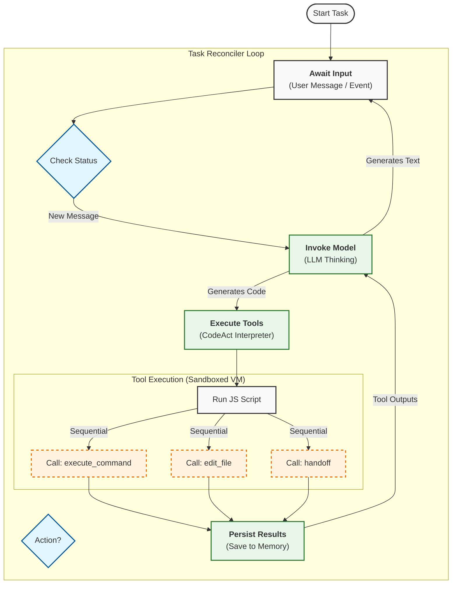

  <h1>Agentic Workflow: The CodeAct Loop</h1>
  
This diagram illustrates the core execution loop of the Construct agent system.

### Workflow Explanation

1.  **Sequential Loop**: The primary architecture is a **sequential loop**. The agent thinks, acts, observes the result, and thinks again.
2.  **Parallelism**: While the *loop* is sequential, the **CodeAct** paradigm allows the agent to write a script that performs multiple actions in a batch.
    *   *Example*: The agent can write a script that edits 3 different files. The Interpreter runs this script. While the script runs sequentially line-by-line, from the "Thinking" perspective, it's a single "Act" step that accomplishes multiple things before the LLM needs to think again.
3.  **Recursion/Looping**: The system loops automatically.
    *   If the Agent runs a command and gets an error, the `Persist` step saves that error.
    *   The flow goes back to `Invoke Model`.
    *   The LLM sees the error and generates a *new* script to fix it.
    *   This continues until the task is complete (`submit_report`) or the agent needs human help (`ask_user`).
